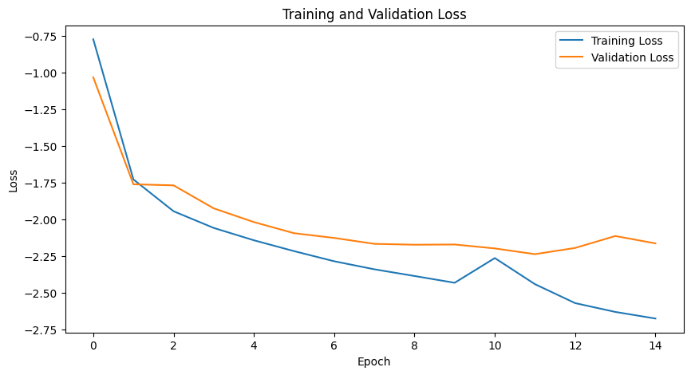
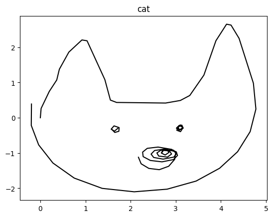
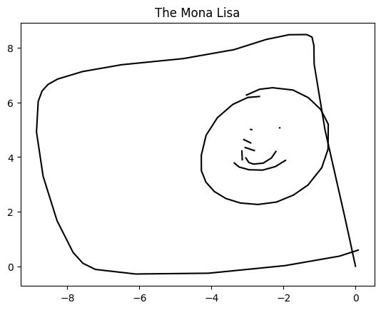

# Text-to-Sketch Generation (Sketch‑RNN)

[](LICENSE)   


Turn hand‑drawn stroke sequences into a compact latent space and **generate new sketches** using a modular, production‑ready codebase split from a Jupyter notebook.

## Highlights
- **Modular package**: `sketch/` with `dataset`, `models`, `losses`, `train`, `inference`, `utils`.
- **Sketch‑RNN** encoder/decoder with variational latent space.
- **Training utilities**: clean loop, loss tracking, plots.
- **Inference tools**: sampling, most‑likely latent selection, plotting, and animation.

## Installation
```bash
pip install -e .
```

## Quick Start
**Train**
```bash
python scripts/train.py --data path/to/*.npz --epochs 20 --batch_size 256
```

**Sample**
```bash
python scripts/sample.py --checkpoint path/to/checkpoint.pth
```

## Repository Structure
```
sketch/
  dataset.py       # SketchDataset + preprocess/pad
  models.py        # SketchRNN encoder/decoder/model
  losses.py        # compute_loss, GMM utils, safe_log
  train.py         # train_model + loss plot
  inference.py     # sample_sketch, sketch_latent, plot/animate
  utils.py         # small helpers
scripts/
  train.py         # CLI training
  sample.py        # CLI sampling
pyproject.toml
README.md
assets/           # images extracted from the notebook
```

## Gallery




## Model Overview
This repo implements a variant of **Sketch‑RNN**:
- **Encoder**: Bi‑LSTM → μ, σ (latent) via linear heads.
- **Decoder**: RNN conditioned on z, outputs mixture parameters for (Δx, Δy) and pen states.
- **Loss**: mixture‑density likelihood + KL regularization.

## Dataset Format
We expect **QuickDraw‑like** `.npz` files containing arrays of stroke sequences with columns `(dx, dy, pen_status)` where `pen_status ∈ {0,1,2}`. The dataloader converts to `(Δx, Δy, p1, p2, p3)` representation and pads to length `Nmax`.

## Dev Tips
- Use a new environment (conda/venv) and **PyTorch 2.x**.
- Start with small `Nmax`, batch size, and epochs for sanity checks.
- Use the provided CLI scripts for repeatable runs.

## How to Run

### 1) Install
```bash
python -m venv .venv && source .venv/bin/activate   # (Windows: .venv\Scripts\activate)
pip install -r requirements.txt
pip install -e .
```

### 2) Train
```bash
python scripts/train.py --data path/to/*.npz --epochs 20 --batch_size 256
```

### 3) Sample
```bash
python scripts/sample.py --checkpoint path/to/checkpoint.pth
```


## Requirements (pinned)
```text
torch==2.3.1
numpy==1.26.4
matplotlib==3.8.4
scikit-learn==1.4.2

# optional
jupyter==1.0.0
ipykernel==6.29.5
```
## License
MIT

---
*Generated on 2025-09-28 19:15 UTC from your original notebook, with images extracted from notebook outputs when available.*

> Note: source files are not present in this environment snapshot, so code listings are omitted.

